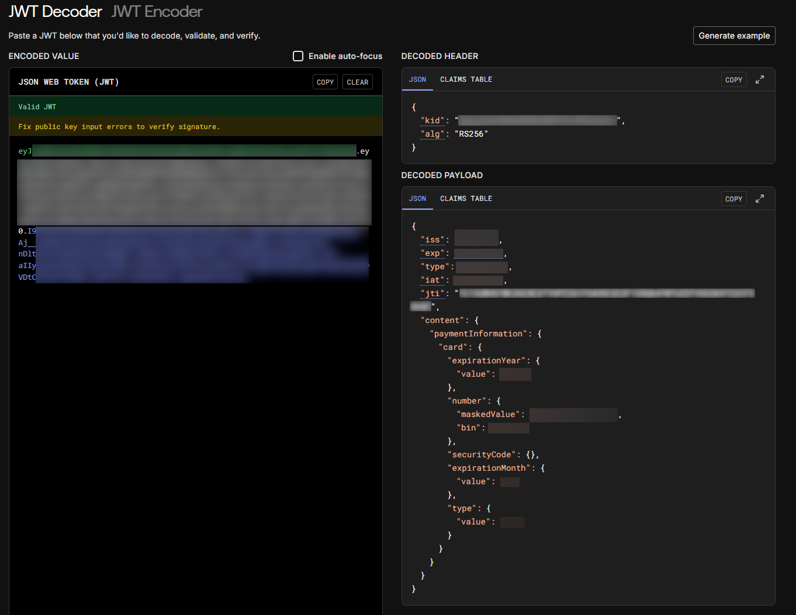

# CyberSource Encryption PoC

This repository contains a fully working Proof of Concept (PoC) that demonstrates how to reconstruct **CyberSource Credit/Debit Card encryption** as used on websites such as **pokemoncenter.com**.

The implementation mirrors CyberSource’s **Flex Microform** flow and produces a valid payment token (`jti`) that can be used during checkout automation.

> ⚠️ **Disclaimer**  
> This project is for educational and research purposes only. You are responsible for complying with all applicable laws, merchant terms of service, and PCI requirements.

📖 [Technical write-up](https://status403.com/blog/cybersource-antifraud?utm_source=github&utm_medium=referral&utm_campaign=cybersource-technical)

---

## Usage

Below is a basic example showing how to tokenize a card using a valid **Capture Context JWT** provided by CyberSource.

```go
func TestTokenizeCard(t *testing.T) {
	client := NewFlexClient()

	// You need a valid capture context JWT from CyberSource
	captureContextJWT := "JWT_TOKEN_HERE"

	card := CardDetails{
		Number:          "4111111111111111",
		SecurityCode:    "123",
		Type:            CardTypeVisa,
		ExpirationMonth: "12",
		ExpirationYear:  "2026",
	}

	token, err := client.TokenizeCard(captureContextJWT, card)
	if err != nil {
		fmt.Printf("Error: %v\n", err)
		return
	}

	fmt.Printf("Token: %s\n", token)
}
```

Important notes

- client.TokenizeCard makes a direct request to the CyberSource API.
- If you plan to integrate this into a bot or automation flow, you should:
    - Add proxy support, or
    - Avoid the network request entirely and use the CreateCardJWE function instead.

Token Format

The returned value is a JWT that contains the encrypted payment information.

After decoding the JWT (for example using [jwt.io](https://jwt.io/)), you will see a payload similar to the following:



The `jti` claim is the payment token required for checkout automation.

## Programmatic Token Extraction

To automatically extract the payment token (jti) from the returned JWT, use the following helper function:

```go
import "github.com/golang-jwt/jwt/v5"

func parsePaymentToken(encoded string) (string, error) {
	token, _, err := jwt.NewParser().ParseUnverified(encoded, jwt.MapClaims{})
	if err != nil {
		return "", err
	}

	claims := token.Claims.(jwt.MapClaims)
	jti, ok := claims["jti"]
	if !ok {
		return "", fmt.Errorf("payment token not found")
	}

	parsed, ok := jti.(string)
	if !ok {
		return "", fmt.Errorf("failed to parse payment token")
	}

	return parsed, nil
}
```

## Capture Context JWT

### What is it?

The Capture Context JWT is a short-lived token issued by CyberSource.
It defines the encryption keys and parameters used to encrypt card data.

Each merchant may expose this token differently.

### Pokémon Center example

On pokemoncenter.com, the Capture Context JWT is returned directly from the following endpoint:

```http
GET /tpci-ecommweb-api/get-payment-iframe-key?microform=true&locale=en-GB
Host: www.pokemoncenter.com
```

Response

```http
{
  "keyId": "eyJ....."
}
```

The value of keyId is the Capture Context JWT required for card encryption.

## Full Flow Diagram

High-level Flow

```
┌──────────────┐
│   Merchant   │
│   Website    │
└──────┬───────┘
       │
       │ 1. GET Capture Context JWT
       ▼
┌──────────────────────────┐
│ Merchant Backend / API   │
│ (e.g. Pokemon Center)    │
└──────┬───────────────────┘
       │
       │  Capture Context JWT
       ▼
┌──────────────────────────┐
│        Client / PoC      │
│ (This repository)        │
└──────┬───────────────────┘
       │
       │ 2. Encrypt card data
       │    using context JWT
       ▼
┌──────────────────────────┐
│     CyberSource Flex     │
│     Tokenization API    │
└──────┬───────────────────┘
       │
       │ 3. payment JWT
       ▼
┌──────────────────────────┐
│        Client / PoC      │
│  Decode JWT, extract jti │
└──────────┬───────────────┘
           │
           │ 4. paymentToken (jti)
           ▼
┌──────────────────────────┐
│   Checkout / Automation  │
└──────────────────────────┘
```

Step-by-step Breakdown

- Retrieve Capture Context
    - Client requests a Capture Context JWT from the merchant endpoint.
- Encrypt Card Details
    - Card number, CVV, and expiry are encrypted using the public key defined in the Capture Context JWT.
    - A JWE payload is created.
- Tokenize with CyberSource
    - The encrypted payload is sent to the CyberSource Flex API.
    - CyberSource validates and tokenizes the card data.
- Extract Payment Token
    - CyberSource returns a JWT.
    - The jti claim inside this JWT is the payment token required for checkout.
